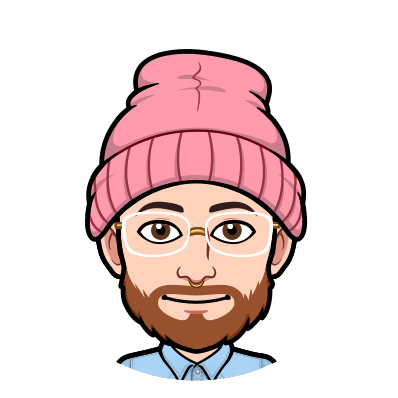
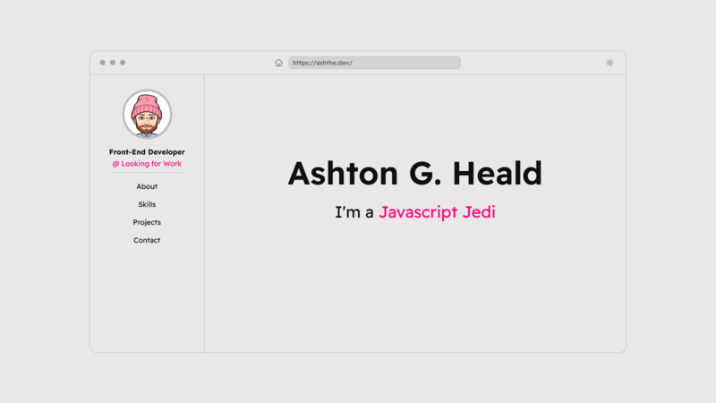
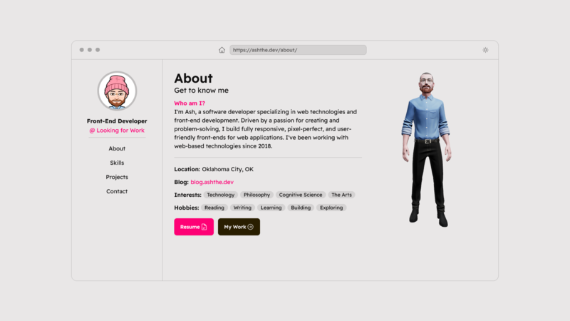
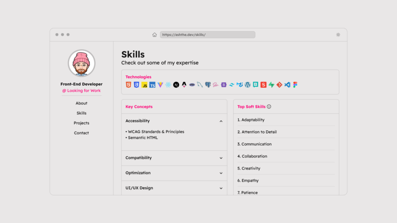
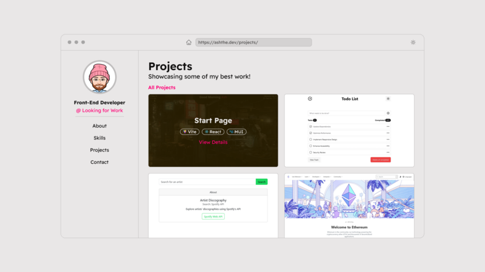
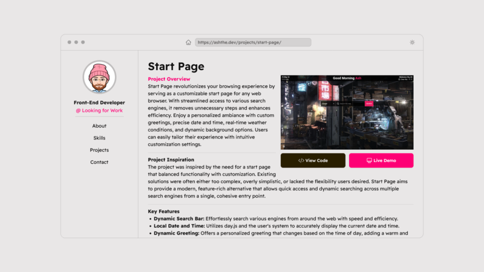
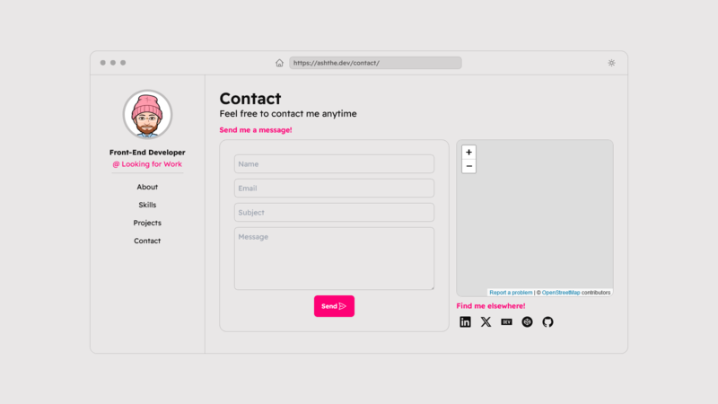

  
  <h1>Portfolioᵛ³</h1>
  

    Personal, Professional Web Development Portfolio
  

  <h4>
    <a href="https://gh.ashthe.dev/todo/">View Demo</a>
  </h4>

## Table of Contents
- [About](#about)
  - [Screenshots](#screenshots)
  - [Description](#description)
  - [Features](#features)
  - [Tech Stack](#tech-stack)

<!-- About -->
##  About
### Screenshots
  
|||
|:---:|:---:|
|||
|||

### Description
  
As a front-end developer seeking to showcasing my skills and projects, I set out to create a personal portfolio website. My objective was to build a visually appealing and user-friendly platform that effectively highlights my expertise, completed projects, and experience in web development. This portfolio has evolved through several iterations, with this being the third and most current version. It features a modern, sleek design inspired by the best elements from my favorite developer portfolios, bringing together a cohesive and polished presentation of me and my work.

### Features

<dl>
  <dt>3D Model</dt>
  <dd>A 3D avatar of myself created using Ready Player Me</dd>
  <dt>CMS Integration</dt>
  <dd>Dynamic project pages and content management powered by a CMS</dd>
  <dt>Theme Options</dt>
  <dd>Light and dark mode for an enhanced user experience</dd>
  <dt>Contact Form</dt>
  <dd>A fully functional contact form utilizing Email.js for easy communicatiom</dd>
  <dt>Location Map</dt>
  <dd>An interactive location map powered by OpenStreetMap</dd>
  <dt>Typewriter Effect</dt>
  <dd>A dynamic typewriter effect implemented using the react-type-animation library</dd>
</dl>

### Tech Stack

  

<b>Other:</b> DaisyUI, Storyblok CMS, EmailJS, OpenStreetMap, Fontsource, Three.js, ReadyPlayerMe/Visage

